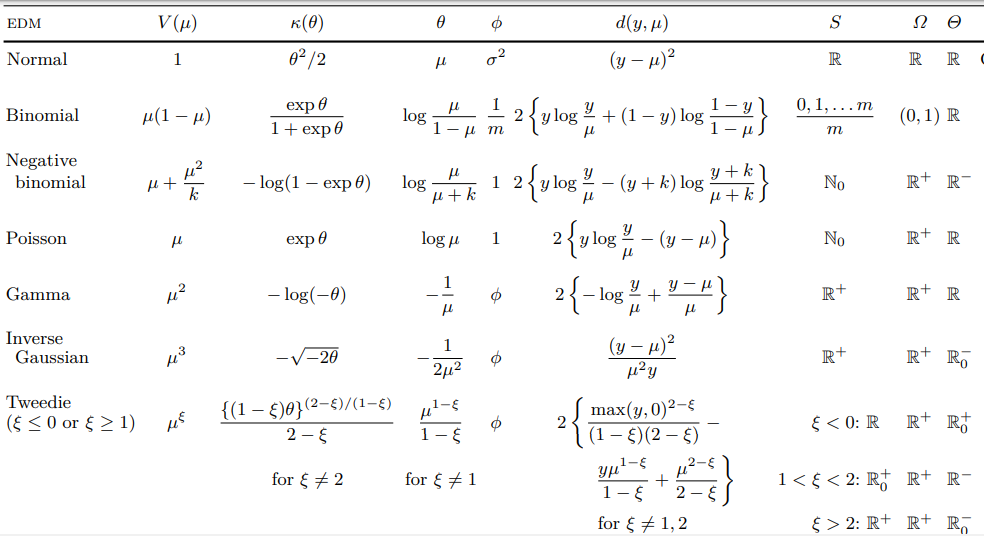

# Ejercicio 2.
A partir de los resultados encontrados de 𝜃, 𝜅(𝜃) y 𝜙 para cada una de las distribuciones EDM del ejercicio anterior, calcule el valor medio $𝜇 = E[𝑦] =\frac{𝑑𝜅 (𝜃)}{𝑑𝜃}$, la función varianza $𝑉 (𝜇) = \frac{d^{2}\kappa (\theta)}{d \theta^{2} }$ y la varianza $var[𝑦] = 𝜙𝑉 (𝜇)$ de cada distribución. Verifique que $E[𝑦]$ y $var[𝑦]$ calculadas de esta forma coinciden con las esperanzas y varianzas conocidas de las distribuciones.  

Dejo cuadro que resume las EDMs del libro de Dunn  

