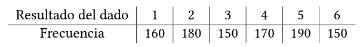

# Ejercicio 4
Se desea determinar si un dado de seis caras está cargado o no. Para ello se arroja el dado 1000 veces obteniéndose los siguientes resultados:
  

Estamos interesados en testear las hipótesis $𝐻_0$: El dado es equilibrado vs. $𝐻_1$: El dado está cargado. Para ello consideramos distintos tests: 
* (a) Sea 𝑋=cantidad de veces que el resultado del dado es par. Plantear las hipótesis y determinar la región de rechazo para un test de nivel aproximado 𝛼 = 0.05 basado en 𝑋. Para el conjunto de datos obtenido, ¿cuál es el valor 𝑝 aproximado?, ¿cuál es la decisión? 
* (b) Sea 𝑌 = cantidad de veces que el resultado del dado es menor o igual que 3. Plantear claramente las hipótesis y determinar la región de rechazo para un test de nivel a proximado 𝛼 = 0.05 basado en 𝑌. Para el conjunto de datos obtenido, ¿cuál es el valor 𝑝 aproximado?, ¿cuál es la decisión?

## Resolución
* a. Planteamos la hipotesis muy parecido al 3 solo que aca la $p_o = 1/2$

    * $H_0: p=p_0 = 1/2$
    * $H_1: p \neq p_0$
    * $\alpha = 0.05$
    * $n= 1000$

Tenemos el estadístico:  

$$
T= \frac{ \bar{x} - 0,05}{0,016}
$$  

La region de rechazo seria: $RR=(|T|\geq Z_{\alpha/2})$  

Nuestro $\bar{x}$ a partir de las muetsras que nos dan nos queda:

$$
\bar{x} = \frac{180+170+150}{1000}=0,5
$$

Nuestro Z crítico es $Z_{0,975} = 1.96$  
Entonces el valor observado nos queda:

$$
\Rightarrow \frac{0}{0,016} = 0 \rightarrow \textrm{ ya que es menor al valor crítico NO rechazamos} \ H_0
$$  

falta completar